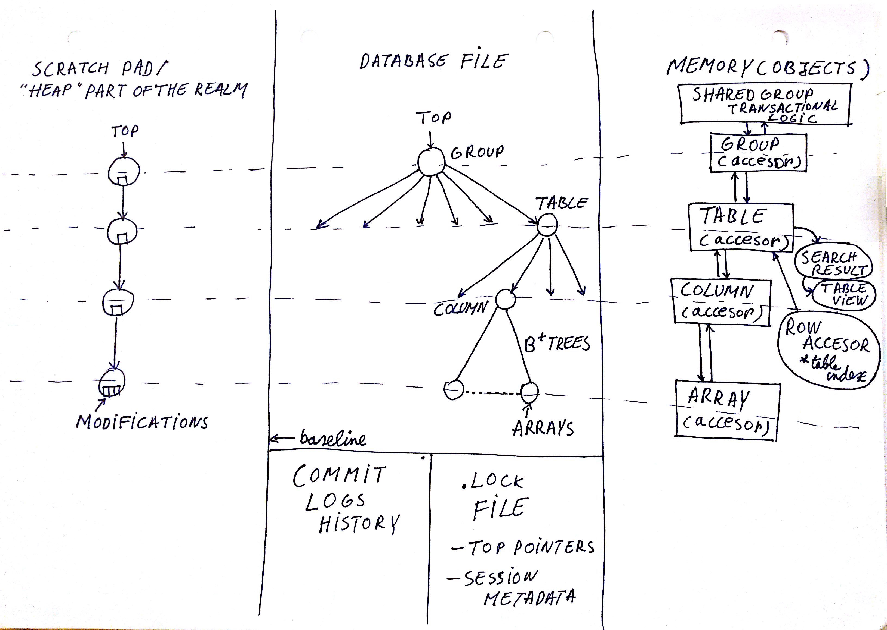

# Files

## Database(.realm file)

The file is memory mapped, and objects in it are referenced with an offset from the start of the file. Objects may or may not be stored contigously,  only arrays are guaranteed to be stored contigously.

### Header

    *current top pointer + other top pointer + switch bit*

The switch bit tells which top pointer is used. It is used so the database will always be readable, no matter when it fails during the update of the top pointer.

First, the top pointer is updated and then the switch bit is updated. If that fails, you will loose all the recent changes, but the database will still be readable.

### Entries

The elements are not allocated contigously. Only arrays are guaranteed to be allocated contiguously.

## .lock file

Contains metadata pertaining to the shared group. This is responsible for allowing multiple threads use the same realm.

## Commit logs history

- Used to update the indexes 
- Used for sync
- Maintained by 3 files:
    two with data
    one that handles management.

## Scratch pad
    
The scratch pad is not a file, but actually in the memory.

# Updates

There are two types of updates:
1. Update of the refs, when a database changes
2. Update of the row indexes in Tables and TableViews. This uses the commit logs.

# Memory mapping:

The whole file is not mapped contagiously, because you might not have enough space if the memory is fragmented.
So the memory is mapped in chunks. The chunks increase exponentially in size. There is an algorithm that can do this in constant time, using a table and bit manipulation.
For the future, we could only map the chunks that we need.